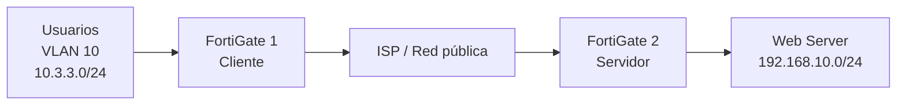

# 02 - Topología y direccionamiento

### Direccionamiento 

| Equipo | Dirección |
|---|---|
| FortiGate 1 WAN | `203.0.113.2/30` |
| Gateway ISP lado FG1 | `203.0.113.1/30` |
| FortiGate 2 WAN | `203.0.113.6/30` |
| Gateway ISP lado FG2 | `203.0.113.5/30` |
| Red de usuarios / lado cliente | `10.3.3.0/24` |
| Red del servidor / lado remoto | `192.168.10.0/24` |

## Diagrama final

