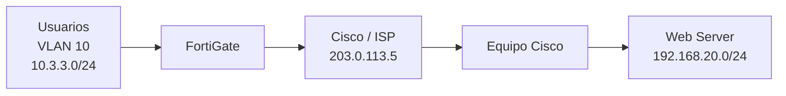

# Infraestructura 2 - VPN Site-to-Site FortiGate a Cisco

## 🎥 Video demostrativo

**Ver primero:** [Video demostrativo](https://youtu.be/RmLSpwIkmC0)

> Coloca aquí el enlace final de YouTube o OneDrive institucional. El video debe cumplir el máximo de 10 minutos y mostrar fecha/hora, rostro y voz.

## 🎯 Propósito

Comunicar la red de usuarios con la red del servidor mediante un enlace VPN Site-to-Site entre un FortiGate y un equipo Cisco, demostrando que la comunicación depende del túnel VPN.

## 🗺️ Topología



## 📚 Documentación

La documentación completa está en:

- [01 - Introducción](documentacion/01-introduccion.md)
- [02 - Topología y direccionamiento](documentacion/02-topologia-y-direccionamiento.md)
- [03 - Configuración](documentacion/03-configuracion.md)
- [04 - Pruebas y evidencias](documentacion/04-pruebas-y-evidencias.md)
- [05 - Seguridad y conclusiones](documentacion/05-seguridad-y-conclusiones.md)

## 📁 Estructura

```text
.
├── README.md
├── documentacion/
├── imagenes/
├── diagramas/
├── scripts/
├── running-configs/
├── evidencias/
└── video/
```

## 📌 Requisitos de entrega

- Configuración documentada.
- Imágenes.
- Diagrama.
- Propósito del laboratorio.
- Scripts utilizados.
- Running-configs.
- Video demostrativo al principio del repositorio.
- Pruebas que demuestren el objetivo de seguridad.

