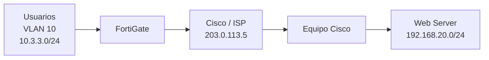

# 02 - Topología y direccionamiento

### Direccionamiento de referencia utilizado en el laboratorio

# Direccionamiento IP – Topología 2

| Equipo / Red       | Dirección         |
| ------------------ | ----------------- |
| VLAN 10 – Usuarios | `10.3.3.0/24` |
| Gateway Usuarios   | `10.3.3.1`        |
| Red Servidores     | `192.168.20.0/24` |
| Gateway Servidores | `192.168.20.1` |
| Cisco VPN – WAN    | `203.0.113.5/30` |
| Peer Cisco VPN     | `203.0.113.6` |

> Verifica que estos valores coincidan exactamente con la topología final presentada en el video y con las capturas.

## Diagrama final

Guarda en `diagramas/` una imagen exportada del diagrama final de GNS3.

Ejemplo de nombre:

`topologia-final.png`
