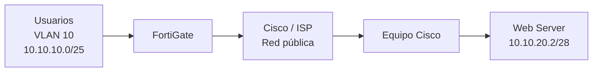

# 02 - Topología y direccionamiento

### Direccionamiento de referencia utilizado en el laboratorio

| Equipo/Red | Dirección |
|---|---|
| VLAN 10 usuarios | `10.10.10.0/25` |
| Gateway usuarios | `10.10.10.1` |
| DHCP usuarios | `10.10.10.10`–`10.10.10.126` |
| Red Web | `10.10.20.0/28` |
| Gateway Web | `10.10.20.1` |
| Web Server | `10.10.20.2` |
| Enlace público lado Cisco | `203.0.113.6/30` |
| Peer Cisco | `203.0.113.5/30` |
| Enlace público lado FortiGate | `203.0.113.2/30` |
| Peer FortiGate | `203.0.113.1/30` |

> Verifica que estos valores coincidan exactamente con la topología final presentada en el video y con las capturas.

## Diagrama final

Guarda en `diagramas/` una imagen exportada del diagrama final de GNS3.

Ejemplo de nombre:

`topologia-final.png`
