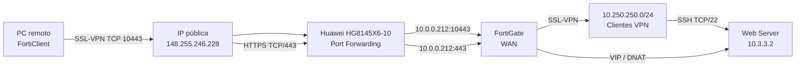

# Infraestructura 3 - Remote Access SSL-VPN con FortiClient

## 🎥 Video demostrativo

**Ver primero:** [Video demostrativo](https://www.youtube.com/watch?v=uYRmt3CJ8qQ)

> Coloca aquí el enlace final de YouTube o OneDrive institucional. El video debe cumplir el máximo de 10 minutos y mostrar fecha/hora, rostro y voz.

## 🎯 Propósito

Permitir que el usuario acceda al servidor web públicamente mediante HTTPS sin VPN, mientras que el acceso administrativo por SSH al servidor se permite únicamente cuando el usuario está conectado mediante SSL-VPN con FortiClient.

## 🗺️ Topología



## 📚 Documentación

La documentación completa está en:

- [01 - Introducción](documentacion/01-introduccion.md)
- [02 - Topología y direccionamiento](documentacion/02-topologia-y-direccionamiento.md)
- [03 - Configuración](documentacion/03-configuracion.md)
- [04 - Pruebas y evidencias](documentacion/04-pruebas-y-evidencias.md)
- [05 - Seguridad y conclusiones](documentacion/05-seguridad-y-conclusiones.md)

## 📁 Estructura

```text
.
├── README.md
├── documentacion/
├── imagenes/
├── diagramas/
├── scripts/
├── running-configs/
├── evidencias/
└── video/
```

## 📌 Requisitos de entrega

- Configuración documentada.
- Imágenes.
- Diagrama.
- Propósito del laboratorio.
- Scripts utilizados.
- Running-configs.
- Video demostrativo al principio del repositorio.
- Pruebas que demuestren el objetivo de seguridad.

## ⚠️ Nota

Las contraseñas, claves precompartidas y secretos reales **no deben subirse al repositorio**. Si una configuración contiene credenciales, reemplázalas por `[REDACTED]` antes de publicarla.
