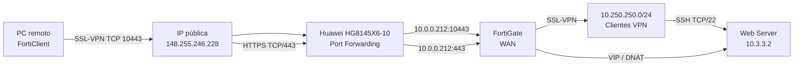

# 02 - Topología y direccionamiento

### Direccionamiento comprobado durante el laboratorio

| Elemento | Dirección / valor |
|---|---|
| IP pública | `148.255.246.228` |
| Huawei LAN/Gateway | `10.0.0.1` |
| FortiGate WAN | `10.0.0.212` |
| Red interna FortiGate | `10.3.3.0/24` |
| Web Server | `10.3.3.2` |
| Puerto HTTPS público | `443/TCP` |
| Puerto SSL-VPN público | `10443/TCP` |
| Pool SSL-VPN | `10.250.250.0/24` |
| DNS VPN 1 | `8.8.8.8` |
| DNS VPN 2 | `1.1.1.1` |
| Usuario VPN | `vpnuser` |
| Grupo VPN | `VPN-USERS` / grupo utilizado en la configuración final |
| Portal | `acceso completo` |
| Interfaz SSL-VPN | WAN / puerto 2 |
| Certificado | `Fábrica de Fortinet` |

### Publicación HTTPS
VIP `VIP-WEB-HTTPS`:
- External IP: `10.0.0.212`
- Mapped IP: `10.3.3.2`
- TCP `443` → `443`
- Política `WAN-to-WEB-HTTPS`
- NAT desactivado en la política.

### Publicación SSL-VPN
Huawei:
- TCP `10443` → `10.0.0.212:10443`

FortiGate:
- SSL-VPN escucha en TCP `10443`.

### Pruebas ya realizadas
`Test-NetConnection 10.0.0.212 -Port 10443` → **True**

`Test-NetConnection 148.255.246.228 -Port 10443` → **True**

> La conexión final de FortiClient y la prueba SSH deben agregarse como evidencia cuando se completen.

## Diagrama final

Guarda en `diagramas/` una imagen exportada del diagrama final de GNS3.

Ejemplo de nombre:

`topologia-final.png`
